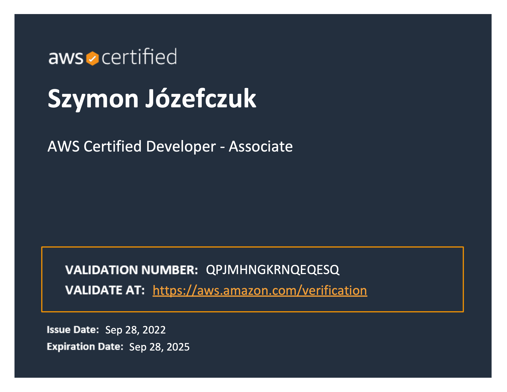
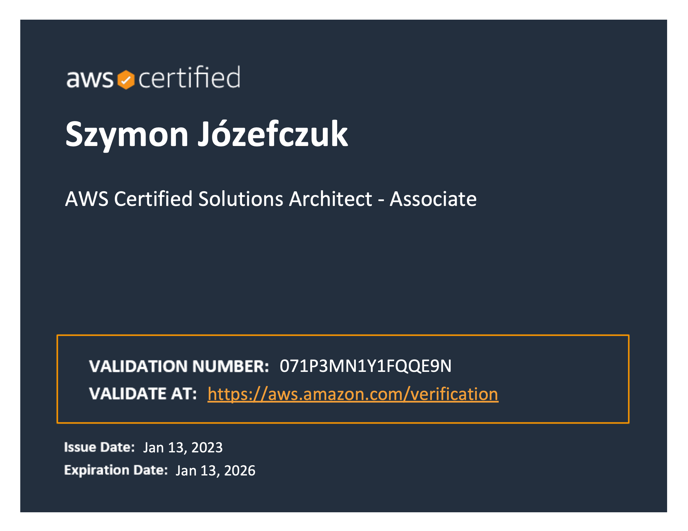
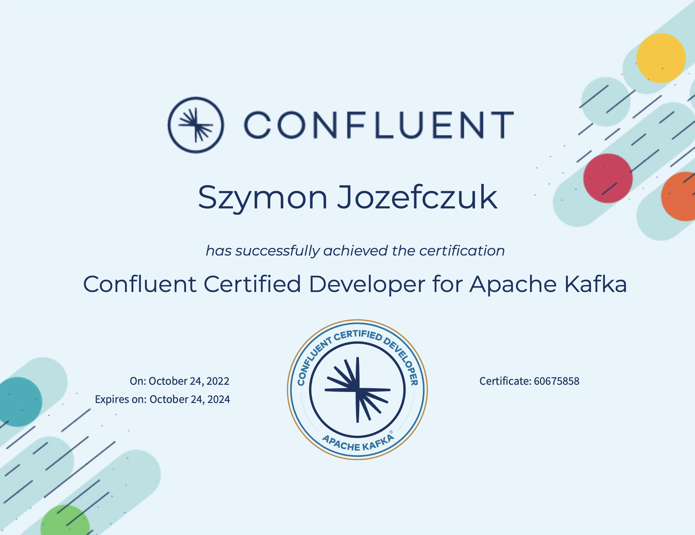

<h3 align="center"><em>Hey, glad to see you here! 👋<em></h4> 
<h4 align="center"><em>Welcome to my Github profile! I’m Simon - a data engineer 👨‍💻 who’s always excited about new tech and big ideas 💡.</em></h5>
 
 
<table>
  <tr> 
   <td align="center" width="50%">
    
    
   </td>
   <td align="center" width="50%">
     
   </td>
  </tr>
</table>
 

 
 
 
 

